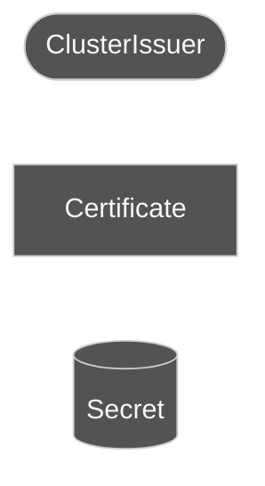
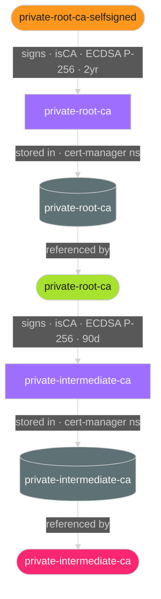

# Operator Manual: cert-manager-extensions

> **Feature sub-manuals:** [GKE TrustConfig Sync](../gke-trust-config-sync/operator-manual.md) — pki-trust-sync pipeline operator manual

## Purpose

`cert-manager-extensions` provisions the private PKI trust hierarchy for a single cluster environment. It deploys five cert-manager resources that form the bootstrapping chain required before any workload leaf certificate can be issued.

This chart is owned by the **security squad** and deployed by ArgoCD as a sub-application of `pki-platform`.

**Prerequisites:** cert-manager ≥ v1.14, Kyverno ≥ v1.9. Kyverno is required unconditionally — the namespace-CA generate and chain-of-custody policies (see below) ship with no `enabled` gate. The five intermediate-ca/leaf-certs audit policies are additionally gated by `pki.policies.enabled: true` (the default); set it `false` to drop just those five.

---

## Architecture





`private-root-ca-selfsigned` is a permanent self-signed issuer retained for cert-manager to auto-renew the root CA. `ClusterIssuer/private-root-ca` signs only the cluster intermediate — it is never referenced by workloads. Consumers reference `ClusterIssuer/private-intermediate-ca`.

### Namespace intermediate CA chain-of-custody contract (pki-platform#328/#364)

Every namespace carrying `pki-managed: "true"` has a chain of **exactly** these
tiers — no more, no fewer:

```
ClusterIssuer/private-intermediate-ca
  └─ Certificate/<namespace>-intermediate-ca → Issuer/<namespace>-ca      (namespace CA, Kyverno-generated)
       └─ Certificate/<product>-intermediate-ca → Issuer/<product>-ca    (optional, at most one, product-owned)
            └─ leaf Certificates                                          (must use the deepest Issuer present)
```

Enforced by `pki-intermediate-ca-issuer` (**Enforce** mode — live-verified zero violations across
all 5 environments before the flip) as three rules:

1. **CAs root at the platform CA.** Every `isCA: true` Certificate must trace back to
   `ClusterIssuer/private-intermediate-ca`, directly or via the namespace CA.
2. **Non-namespace-named intermediates go through the namespace CA, not around it.** Any
   `isCA: true` Certificate whose name isn't `<namespace>-intermediate-ca` must reference
   *this namespace's own* `Issuer/<namespace>-ca` — not the ClusterIssuer directly, and not
   another namespace's Issuer. This is also what caps the chain at two tiers: a would-be third
   tier has nothing else it's allowed to reference.
3. **Leaves use the last CA in the chain.** If a namespace has a product-level CA, its leaves
   must issue from that product Issuer, not skip past it to the namespace Issuer.

**A chain longer than namespace CA → one optional product CA → leaf is a rule violation**, not
a variant this contract accommodates. If a real case ever needs a third tier, that's a change to
this contract (and to `pki-intermediate-ca-issuer`), not a namespace opting out of it.

---

## Resources Deployed

### cert-manager resources (always deployed)

| Kind | Name | Namespace | Purpose |
|------|------|-----------|---------|
| `ClusterIssuer` | `private-root-ca-selfsigned` | cluster-scoped | Permanent self-signed issuer; issues and auto-renews the root CA Certificate only |
| `Certificate` | `private-root-ca` | `cert-manager` | Root CA — ECDSA P-256, `isCA: true`, 2-year validity |
| `ClusterIssuer` | `private-root-ca` | cluster-scoped | Signs the cluster intermediate CA only |
| `Certificate` | `private-intermediate-ca` | `cert-manager` | Cluster intermediate CA — ECDSA P-256, `isCA: true`, 90-day validity |
| `ClusterIssuer` | `private-intermediate-ca` | cluster-scoped | Consumer-facing issuer — referenced by namespace intermediate CA `Certificate` resources |

### Namespace CA generation support (always deployed)

| Kind | Name | Namespace | Purpose |
|------|------|-----------|---------|
| `MetadataBehavior` | `pki-managed-namespace-trigger` | `cert-manager` | Registers `pki-managed` as a governed contract label for the generate policy below |
| `ClusterRole` | `kyverno-background-controller:generate-namespace-intermediate-ca` | cluster-scoped | Grants `kyverno-background-controller` create/update/delete/get/list/watch on `cert-manager.io` Certificates and Issuers cluster-wide |
| `ClusterRoleBinding` | `kyverno-background-controller:generate-namespace-intermediate-ca` | cluster-scoped | Binds the ClusterRole above to ServiceAccount `kyverno-background-controller` in `kyverno` |

Without this RBAC pair, `generate-namespace-intermediate-ca` fails admission with a permissions error — the generate policy is declared but cannot create resources.

### Kyverno ClusterPolicies

#### Enforce policies (`pki.policies.enabled: true`, the default)

| Kind | Name | Feature | What it enforces |
|------|------|---------|----------------|
| `ClusterPolicy` | `pki-intermediate-ca-issuer` | intermediate-ca | Blocks admission that violates the [namespace intermediate CA chain-of-custody contract](#namespace-intermediate-ca-chain-of-custody-contract-pki-platform328364) above, as four rules: `namespace-ca-must-use-platform-issuer`, `product-level-ca-must-use-namespace-issuer`, `leaf-must-use-deepest-namespace-ca`, `unmanaged-namespace-ca-must-use-platform-issuer` |

#### Audit policies (`pki.policies.enabled: true`, the default)

These four run in `Audit` mode — violations are surfaced in `PolicyReport` resources and policy-reporter, but workloads are never blocked. Set `pki.policies.enabled: false` to drop these four plus the Enforce policy above; this does not affect namespace-CA generation below, which has its own, ungated switch.

| Kind | Name | Feature | What it audits |
|------|------|---------|----------------|
| `ClusterPolicy` | `pki-restrict-platform-clusterissuers` | intermediate-ca | Consumer `Certificate` resources must not reference platform ClusterIssuers directly |
| `ClusterPolicy` | `pki-intermediate-ca-max-validity` | intermediate-ca | Intermediate CA validity must not exceed 2160h (90 days) |
| `ClusterPolicy` | `pki-cert-sign-usage-requires-isca` | leaf-certs | `cert sign` key usage requires `isCA: true` |
| `ClusterPolicy` | `pki-no-selfsigned-leaf-certs` | leaf-certs | Leaf `Certificate` resources must not reference a self-signed namespace `Issuer` |

#### Namespace CA generation (unconditional, no `enabled` gate)

| Kind | Name | Feature | Mode | What it does |
|------|------|---------|------|--------------|
| `ClusterPolicy` | `generate-namespace-intermediate-ca` | namespace-ca | Generate | Provisions `Certificate/<namespace>-intermediate-ca` + `Issuer/<namespace>-ca` for any namespace carrying `pki-managed: "true"`. Ships to all 5 environments. |
| `ClusterPolicy` | `pki-namespace-ca-chain-of-custody` | namespace-ca | Audit | Rejects namespace CAs/Issuers not produced by `generate-namespace-intermediate-ca` above — part of the [chain-of-custody contract](#namespace-intermediate-ca-chain-of-custody-contract-pki-platform328364). |

`generate-namespace-intermediate-ca` is a Kyverno **generate** rule, not a validate rule, so "Audit vs Enforce" doesn't apply to it the way it does the policies above — it either creates the Certificate/Issuer or it doesn't; there is no blocking behavior to soften.

---

## Deployment

### Per-environment values

Each environment has a dedicated values file at `cd/cert-manager-extensions/<env>/values.yaml`. The only required field is `labels.environment` — all other values are derived or use chart defaults:

```yaml
# cd/cert-manager-extensions/qac/values.yaml
---
labels:
  environment: qac
```

`pki.namespaceCA.label` (default `pki-managed`), `pki.namespaceCA.validity`/`renewBefore`, and `pki.namespaceCA.chainOfCustody.validationFailureAction` (default `Audit`) are also configurable per environment, but every environment ships the same unconditional generate and chain-of-custody policies — there is no per-environment `enabled` toggle for namespace-CA generation.

The root CA and intermediate CA `commonName` values are auto-generated from the environment label:

| Environment | Root CA commonName | Intermediate CA commonName |
|-------------|-------------------|---------------------------|
| `qac` | `Adaptive Enforcement Lab Private Root CA QAC` | `Adaptive Enforcement Lab Private Intermediate CA QAC` |
| `dev` | `Adaptive Enforcement Lab Private Root CA DEV` | `Adaptive Enforcement Lab Private Intermediate CA DEV` |
| `stg` | `Adaptive Enforcement Lab Private Root CA STG` | `Adaptive Enforcement Lab Private Intermediate CA STG` |
| `prd` | `Adaptive Enforcement Lab Private Root CA PRD` | `Adaptive Enforcement Lab Private Intermediate CA PRD` |
| `ops` | `Adaptive Enforcement Lab Private Root CA OPS` | `Adaptive Enforcement Lab Private Intermediate CA OPS` |

### Environment promotion order


Each environment has an isolated root CA. QAC certs cannot authenticate on PRD and vice versa. This is intentional.

### ArgoCD wiring

The application is registered in `cd/<env>/values.yaml` under the `argo-applications` chart. It pulls its Helm chart from the internal chartmuseum and its values from this repository:

```yaml
- name: cert-manager-extensions
  namespace: cert-manager
  project: security
  helm:
    chart: cert-manager-extensions
    repoURL: http://chartmuseum.platform:8080/
    version: ">=0.0.0"
  values:
    repoURL: '<this repo's git URL>'
    targetRevision: main
    files:
      - $values/cd/cert-manager-extensions/<env>/values.yaml
```

> QAC uses `>=0.0.0-0` to include pre-release chart versions for early validation.

---

## Verification

After sync, confirm the full trust hierarchy is operational:

```bash
# All three issuers must be Ready
kubectl get clusterissuer private-root-ca-selfsigned private-root-ca private-intermediate-ca

# NAME                      READY
# private-root-ca-selfsigned      True
# private-root-ca           True
# private-intermediate-ca   True

# Both certificates issued and up to date
kubectl get certificate private-root-ca private-intermediate-ca -n cert-manager

# NAME                      READY   SECRET
# private-root-ca           True    private-root-ca
# private-intermediate-ca   True    private-intermediate-ca

# Both secrets exist with all three keys
kubectl get secret private-root-ca private-intermediate-ca -n cert-manager
# NAME                      TYPE                DATA
# private-root-ca           kubernetes.io/tls   3
# private-intermediate-ca   kubernetes.io/tls   3
```

### Kyverno policy status

```bash
# All seven ClusterPolicies must be Ready
kubectl get clusterpolicy \
  pki-restrict-platform-clusterissuers \
  pki-intermediate-ca-issuer \
  pki-intermediate-ca-max-validity \
  pki-cert-sign-usage-requires-isca \
  pki-no-selfsigned-leaf-certs \
  generate-namespace-intermediate-ca \
  pki-namespace-ca-chain-of-custody

# Check policy reports for violations across all namespaces
kubectl get policyreport -A

# See detailed results for a specific policy
kubectl get policyreport -A -o json \
  | jq -r '.items[].results[]
           | select(.policy == "pki-restrict-platform-clusterissuers")
           | "\(.result) \(.resources[0].namespace)/\(.resources[0].name)"'
```

If policy-reporter is deployed with `rest.enabled: true`, results are also available via its REST API:

```bash
kubectl port-forward -n policy-reporter svc/policy-reporter 9080:8080
curl -s 'http://localhost:9080/v1/namespaced-resources/results?policies=pki-intermediate-ca-issuer' \
  | jq -r '.items[] | "\(.status) \(.namespace)/\(.resource.name)"'
```

---

The three data keys in each secret:

| Key | Content |
|-----|---------|
| `ca.crt` | Issuer's public certificate (trust anchor for that level) |
| `tls.crt` | Full certificate chain |
| `tls.key` | Private key — never leaves the cluster |

---

## PKI Lifecycle

### Validity and renewal

| Resource | Validity | Renewal window | Auto-renewed |
|----------|----------|----------------|-------------|
| Root CA | 2 years | 30 days | Yes |
| Cluster intermediate CA | 90 days | 7 days | Yes |

cert-manager renews both automatically. Intermediate CA rotation is fully silent — already-issued leaf certs remain valid until their own expiry, independent of the intermediate's renewal. Root CA rotation in PRD warrants a security squad review before it occurs.

### Manual rotation (emergency)

**Intermediate CA** — safe to rotate at any time; new leaf certs will be issued from the new intermediate:

```bash
kubectl delete certificate private-intermediate-ca -n cert-manager
kubectl delete secret private-intermediate-ca -n cert-manager
```

**Root CA** — cascading impact; all intermediate CAs and leaf certs that chain to the old root become untrusted. Coordinate across all teams before proceeding:

```bash
kubectl delete certificate private-root-ca -n cert-manager
kubectl delete secret private-root-ca -n cert-manager
# cert-manager immediately re-issues root, then intermediate, then consumers' namespace intermediates renew
```

### Secret access control

Both `Secret/private-root-ca` and `Secret/private-intermediate-ca` in the `cert-manager` namespace contain CA private keys. Access is restricted by RBAC — only cert-manager's service account and the operator require access. Never mount or copy these secrets into workload pods.

---

## Troubleshooting

### `ClusterIssuer` not Ready

```bash
kubectl describe clusterissuer private-root-ca
kubectl describe clusterissuer private-intermediate-ca
# Check "Status" and "Events" sections
```

Common causes:
- Backing Secret does not exist yet — cert-manager issues the Certificate first; the ClusterIssuer becomes ready once the Secret is populated
- Ordering issue — `private-intermediate-ca` ClusterIssuer depends on `private-root-ca` ClusterIssuer being ready first
- cert-manager controller pod not running — `kubectl get pods -n cert-manager`
- `private-root-ca-selfsigned` ClusterIssuer missing — it must exist before `private-root-ca` Certificate can be issued or renewed

### Certificate stuck in `False` / Issuing state

```bash
kubectl get certificaterequest -n cert-manager
kubectl describe certificaterequest <name> -n cert-manager
```

### Confirming CA certificate details

```bash
# Root CA
kubectl get secret private-root-ca -n cert-manager \
  -o jsonpath='{.data.ca\.crt}' | base64 -d | openssl x509 -noout -text

# Intermediate CA
kubectl get secret private-intermediate-ca -n cert-manager \
  -o jsonpath='{.data.ca\.crt}' | base64 -d | openssl x509 -noout -text
```

Check: `CA:TRUE`, `Subject` matches the auto-generated `commonName` for the environment, validity dates are within expected range.

---

## Values Reference

```yaml
pki:
  rootCA:
    validity: "17520h"    # 2 years
    renewBefore: "720h"   # 30 days
  intermediateCA:
    validity: "2160h"     # 90 days
    renewBefore: "168h"   # 7 days
  policies:
    enabled: true         # set false if Kyverno is not installed

labels:
  component: pki
  environment: ""         # set per-environment — drives commonName generation
  adaptive-enforcement-lab.com/squad: security
  adaptive-enforcement-lab.com/maintainer: mark.cheret
```
