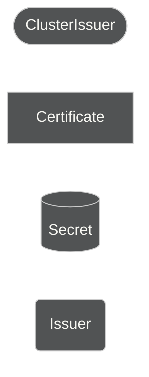
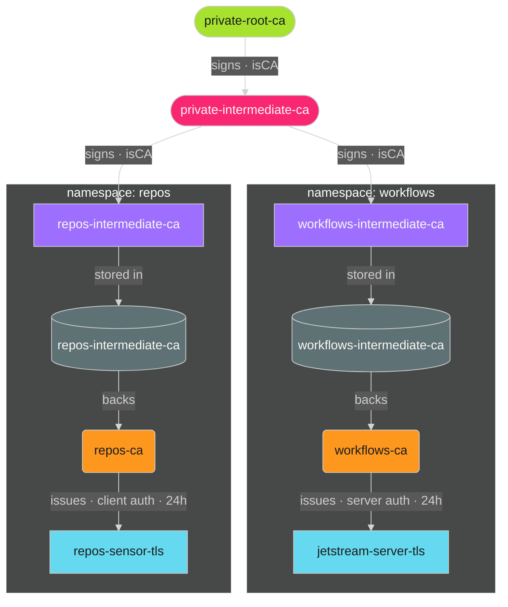
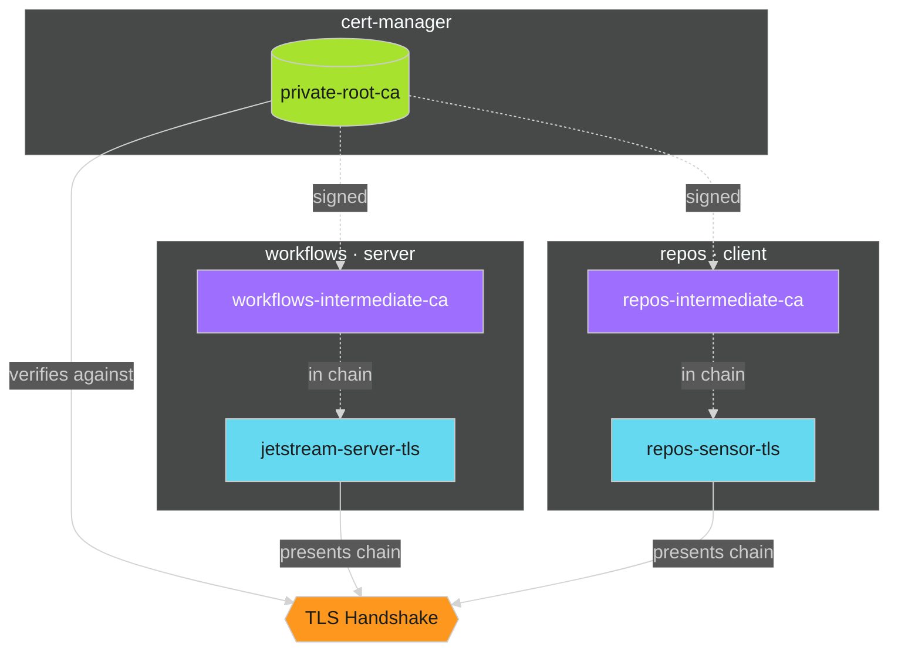

# User Guide: Issuing TLS Certificates via an Intermediate CA

> **Related guides:**
> [GKE TrustConfig Sync — User Guide](../gke-trust-config-sync/user-guide.md) — BackendTLSPolicy and backend mTLS with GKE Gateway
> [private-pki-operator — Workload Trust Bundle](../private-pki-operator/user-guide.md) — which ConfigMap to mount and why it matters during root CA rotation

## Overview

You do not reference `ClusterIssuer/private-root-ca` or `ClusterIssuer/private-intermediate-ca` directly in your workloads. Instead, every
`pki-managed` namespace automatically gets a namespace-scoped **intermediate CA** signed by the cluster intermediate — generated for you the
moment you label the namespace — and you issue leaf certs from that intermediate. This gives your namespace full control over certificate
issuance without touching the cluster trust anchors, and without hand-authoring the CA or its Issuer yourself.

The chain below is generated automatically by the `generate-namespace-intermediate-ca` Kyverno policy for every labeled namespace:






---

## Step 1 — Label Your Namespace

Add the `pki-managed` label to your namespace:

```yaml
apiVersion: v1
kind: Namespace
metadata:
  name: workflows
  labels:
    pki-managed: "true"
```

That's it — there is nothing else to author by hand. The `generate-namespace-intermediate-ca` Kyverno policy watches for
this label and automatically creates, in your namespace:

- `Certificate/<namespace>-intermediate-ca` — signed by `ClusterIssuer/private-intermediate-ca`
- `Issuer/<namespace>-ca` — backed by that certificate's secret

Verify both landed:

```bash
kubectl get certificate,issuer -n workflows
```

```
NAME                                                     READY   SECRET                       AGE
certificate.cert-manager.io/workflows-intermediate-ca    True    workflows-intermediate-ca   2m

NAME                                   READY   AGE
issuer.cert-manager.io/workflows-ca    True    2m
```

From this point, any `Certificate` in the `workflows` namespace can reference `Issuer/workflows-ca`. No other namespace
can use it.

---

## Step 2 — (Optional) Add a Product-Level Intermediate CA

Most namespaces stop at Step 1 and issue leaf certs straight off `Issuer/<namespace>-ca`. Skip this step unless your
namespace hosts more than one product and you need a further sub-CA scoped to just one of them.

This tier is still hand-authored — it's optional, at most one per namespace, and it must chain off your namespace's
auto-generated `Issuer`, never off `ClusterIssuer/private-intermediate-ca` directly:

```yaml
# real example: the "workflows" product's namespace is actually named "platform"
apiVersion: cert-manager.io/v1
kind: Certificate
metadata:
  name: workflows-intermediate-ca
  namespace: platform
spec:
  isCA: true
  commonName: "Adaptive Enforcement Lab Intermediate CA — QAC"
  secretName: workflows-intermediate-ca
  duration: "2160h"      # 90 days — renews automatically
  renewBefore: "168h"
  privateKey:
    algorithm: ECDSA
    size: 256
    rotationPolicy: Always  # key rotates on every renewal
  issuerRef:
    name: platform-ca    # ← your namespace's auto-generated Issuer, not the ClusterIssuer
    kind: Issuer
    group: cert-manager.io
```

This creates `Secret/workflows-intermediate-ca` in `namespace: platform` containing the product-level intermediate CA
key and cert. Expose it as its own `Issuer` the same way the platform did for your namespace CA:

```yaml
apiVersion: cert-manager.io/v1
kind: Issuer
metadata:
  name: workflows-ca
  namespace: platform
spec:
  ca:
    secretName: workflows-intermediate-ca
```

---

## Step 3 — Issue Leaf Certs

Leaf certs are short-lived by default. cert-manager rotates them automatically — no revocation infrastructure
required. A compromised leaf cert expires within 24 hours regardless.

```yaml
apiVersion: cert-manager.io/v1
kind: Certificate
metadata:
  name: jetstream-server-tls
  namespace: workflows
spec:
  secretName: jetstream-server-tls
  issuerRef:
    name: workflows-ca     # ← your issuer, not the root
    kind: Issuer
    group: cert-manager.io
  commonName: jetstream.workflows.svc.cluster.local
  dnsNames:
    - jetstream.workflows.svc.cluster.local
    - jetstream.workflows.svc
  usages:
    - server auth
  duration: "24h"        # short-lived — cert-manager rotates automatically
  renewBefore: "8h"      # begin renewal with 8h remaining
  privateKey:
    algorithm: ECDSA
    size: 256
    rotationPolicy: Always  # key rotates on every renewal
```

> **Mount as a volume, not an environment variable.** Kubernetes propagates Secret updates to volume mounts
> automatically (within ~1 minute). Environment variables require a pod restart to pick up renewed certs.

The resulting `Secret/jetstream-server-tls` contains:

| Key | Content |
|-----|---------|
| `tls.crt` | Leaf cert + intermediate cert (full chain PEM) |
| `tls.key` | Leaf private key |
| `ca.crt` | Intermediate CA public cert (`workflows-intermediate-ca`) |

---

## mTLS: workflows JetStream ↔ repos Event Sensors

When `repos` event sensors connect to `workflows` JetStream over mTLS, both sides issue their own leaf certs from their
own intermediate CAs — both of which chain to the same `private-root-ca` root.

### repos — client cert

`repos` is labeled `pki-managed: "true"` (Step 1), so `Certificate/repos-intermediate-ca` and
`Issuer/repos-ca` already exist — nothing to author there. Only the leaf cert is hand-written:

```yaml
# repos/sensor-client-tls.yaml
apiVersion: cert-manager.io/v1
kind: Certificate
metadata:
  name: repos-sensor-tls
  namespace: repos
spec:
  secretName: repos-sensor-tls
  issuerRef:
    name: repos-ca
    kind: Issuer
    group: cert-manager.io
  commonName: repos-sensor.repos.svc.cluster.local
  usages:
    - client auth
  duration: "24h"
  renewBefore: "8h"
  privateKey:
    algorithm: ECDSA
    size: 256
    rotationPolicy: Always
```

### How the handshake resolves




Because the intermediates are different, neither side's `ca.crt` (which points at its own intermediate) is sufficient to
verify the other side. Both sides must trust the **root CA** as the verification anchor.

### Distributing the root CA cert

trust-manager automatically distributes the root CA certificate to **every namespace** as a `ConfigMap` named
`private-root-ca` (key: `ca.crt`). No action is required from your team to provision it — the platform keeps it
current across root CA renewals.

Mount it in your pod spec:

```yaml
volumes:
  - name: root-ca
    configMap:
      name: private-root-ca   # distributed by trust-manager — do not create manually
      items:
        - key: ca.crt
          path: ca.crt
volumeMounts:
  - name: root-ca
    mountPath: /etc/ssl/platform
    readOnly: true
```

Then point your JetStream server's `clientAuth` CA and your sensor's `serverCA` at `/etc/ssl/platform/ca.crt`.

> **Why this matters for key rotation.** If you mount `ca.crt` from a cert-manager Secret directly, that value
> is pinned to the key that signed your intermediate CA at issuance time. When the root CA key rotates,
> your pinned copy becomes stale and TLS verification fails. The `private-root-ca` ConfigMap is always
> kept up to date by trust-manager and survives root CA rotation transparently.
>
> During rotation the ConfigMap briefly contains **both** the old and new root CA PEMs — this is the
> dual-trust window managed by the `private-pki-operator`. See
> [Workload Trust Bundle Configuration](../private-pki-operator/user-guide.md) for full details.

---

## Trust Granularity Options

| Approach | Server trusts | Security posture |
|----------|--------------|-----------------|
| Root CA as trust anchor | Any cert in the Adaptive Enforcement Lab PKI | Broader — all squads can connect |
| Peer's intermediate CA | Only certs from a specific squad's issuer | Narrower — explicit allow-list per squad |

To restrict JetStream to only accept `repos`-issued client certs, configure `clientCAFile` with `repos-intermediate-ca`'s
`ca.crt` instead of the root. This requires sharing the intermediate CA cert between namespaces.

---

## Validity and Renewal

The guiding principle is **short-lived leaves, longer-lived CAs**. Short-lived leaf certs expire fast enough that
revocation is never needed — a leaked private key becomes worthless within 24 hours without any operator action.

cert-manager renews everything automatically:

| Resource | Validity | Renewal window | Managed by |
|----------|----------|----------------|------------|
| Root CA | 2 years | 30 days | Platform (security squad) |
| Cluster intermediate CA | 90 days | 7 days | Platform (security squad) |
| Namespace intermediate CA | 90 days | 7 days | Platform (auto-generated on namespace label) |
| Leaf cert | **24 hours** | 8 hours | Automatic — no action needed |

The intermediate CA renews quarterly and silently. All leaf certs it issued continue to work — they were already
signed and are independent of the intermediate's own renewal.

If a workload needs a longer-lived cert for a specific reason (e.g. a batch job that runs offline), override
`duration` explicitly on that `Certificate` resource. The default should remain 24h.

---

## Environment Isolation

Each environment has an independent root CA. Intermediate CAs and leaf certs issued in QAC are signed by the QAC root
and cannot authenticate on PRD. Label the namespace (Step 1) in each environment alongside your workload deployment —
the namespace intermediate CA and Issuer are generated per-environment automatically, chained to that environment's
own root.

---

## Do Not Use

| Resource | Why | Audit policy |
|----------|-----|-------------|
| `ClusterIssuer/private-root-ca-selfsigned` | Platform internal — issues and auto-renews the root CA only | `pki-restrict-platform-clusterissuers` |
| `ClusterIssuer/private-root-ca` | Platform boundary — signs only the cluster intermediate CA, nothing else | `pki-restrict-platform-clusterissuers` |
| `ClusterIssuer/private-intermediate-ca` directly in leaf certs or product-level CAs | Platform boundary — use your namespace `Issuer` instead | `pki-restrict-platform-clusterissuers` |
| A self-signed `Issuer` to back leaf certs | Leaf certs must chain to the platform intermediate CA | `pki-no-selfsigned-leaf-certs` |
| RSA or non-P256 ECDSA keys | All certificates must use ECDSA P-256 | `pki-require-ecdsa-256` |
| Omitting `spec.privateKey.rotationPolicy` | cert-manager silently defaults to `Never` — key never rotates | `pki-rotation-policy-required` |
| Mounting `ca.crt` from a cert Secret for root CA trust | Pinned value goes stale on root CA rotation — use `private-root-ca` ConfigMap | `pki-trust-bundle-adoption` |

Violations are surfaced in `PolicyReport` resources (cluster-scoped background scan, audit mode — workloads are never blocked). Contact the **security squad** if you have a legitimate exception.

---

## Getting Help

Contact the **security squad** or open an issue in pki-platform for:

- Root CA cert distribution questions (the `private-root-ca` ConfigMap is provisioned automatically by trust-manager)
- GKE TrustConfig / BackendAuthenticationConfig provisioning
- Intermediate CA cert sharing between namespaces
