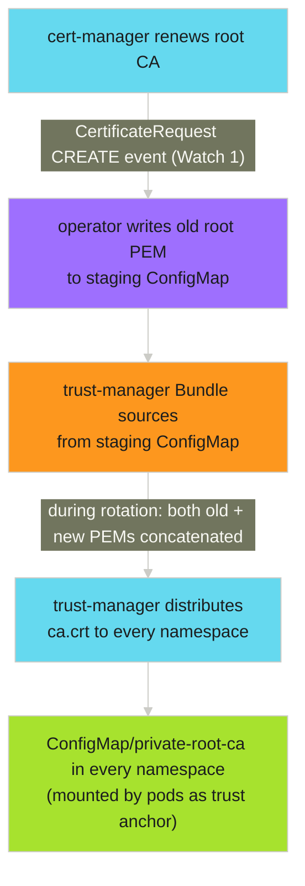
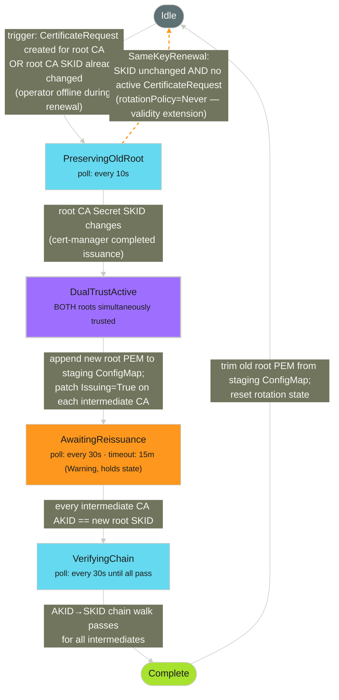

# Operator Manual: private-pki-operator

> **ADR:** [DEC-002 — private-pki-operator](../../architecture/ADRs/DEC-002-private-pki-operator.md)
> **Standards assessment:** [Industry Best Practice Assessment](../../architecture/analysis/private-pki-operator-standards.md)
> **Upstream path:** [Upstream Submission Analysis](../../architecture/analysis/private-pki-operator-upstream.md)

## Purpose

`private-pki-operator` automates zero-downtime root CA rotation for cert-manager + trust-manager PKI hierarchies. It implements a dual-trust window state machine: when cert-manager renews the root CA, the operator ensures both the old and new roots are simultaneously trusted until all intermediate CAs have been re-issued against the new root. Only then does the old root leave the trust bundle.

Without this operator, cert-manager's trust-manager atomically swaps the old root for the new one at the moment of renewal. Any workload whose cert chains to the old root fails TLS verification immediately, before re-issuance can complete. This is what caused the QAC incident on 2026-02-20.

---

## Architecture

### Trust distribution path



The staging ConfigMap (`private-root-ca-trust-anchor` in `cert-manager` namespace) is the authoritative trust source throughout the rotation lifecycle. It is written only by the operator. trust-manager reads from it and distributes its contents cluster-wide.

### State machine



Every transition is recorded in `PKIRotation.status`. Every phase is idempotent — the operator can restart at any point and converge correctly.

### Zero-gap proof

When the CertificateRequest is created (the trigger for `PreservingOldRoot`), the staging ConfigMap already holds the old root PEM — it was written there at the previous `Complete` step and has been the sole Bundle source ever since. The operator extends the ConfigMap to hold both PEMs before cert-manager writes the new cert to the Secret. trust-manager sees a single ConfigMap change with two concatenated certs. There is never a moment with zero roots, or with only the new root, before intermediate re-issuance completes.

### Intermediate discovery

Intermediates are discovered at rotation time from the cluster state. The operator does not require any intermediate CA names in the spec:


Adding a new intermediate CA to the cluster requires zero changes to the `PKIRotation` resource.

### Reissuance trigger

The operator forces immediate re-issuance by **patching the intermediate CA Certificate's status subresource** with an `Issuing: True` condition. This is the same mechanism used by `cmctl renew`: cert-manager's trigger controller watches for `Issuing: True` and creates a new CertificateRequest within seconds, signed against whichever ClusterIssuer is currently active (the new root CA after rotation).

This is idempotent: if `Issuing` is already `True` when the operator runs, cert-manager is already working on re-issuance and the condition patch is a no-op.

---

## Resources Deployed

### `private-pki-operator` Helm chart (`charts/private-pki-operator/`)

| Kind | Name | Namespace | Purpose |
|------|------|-----------|---------|
| `ServiceAccount` | `private-pki-operator` | `cert-manager` | Operator identity |
| `ClusterRole` | `private-pki-operator` | cluster-scoped | Cluster-scoped resources: clusterissuers, pkirotations, bundles |
| `ClusterRoleBinding` | `private-pki-operator` | cluster-scoped | Binds ClusterRole to ServiceAccount |
| `Role` | `private-pki-operator` | `cert-manager` | Namespace-scoped resources: secrets (read-only), configmaps, certificates, certificaterequests |
| `RoleBinding` | `private-pki-operator` | `cert-manager` | Binds Role to ServiceAccount |
| `Role` | `private-pki-operator-events` | `default` | Events create/patch — cluster-scoped CRD events land in the default namespace |
| `RoleBinding` | `private-pki-operator-events` | `default` | Binds Role to ServiceAccount |
| `Role` | `private-pki-operator-leader-election` | `cert-manager` | Leader election lease management |
| `RoleBinding` | `private-pki-operator-leader-election` | `cert-manager` | Binds Role to ServiceAccount |
| `Deployment` | `private-pki-operator` | `cert-manager` | Operator pod |
| `PKIRotation` | `platform-root-ca` | cluster-scoped | CRD instance (gated by `pkirotation.enabled`) |

The `PKIRotation` CR is only rendered when `pkirotation.enabled: true` in values. The `ConfigMap/private-root-ca-trust-anchor` and `Bundle/private-root-ca` are **not** Helm resources — the operator creates and manages them dynamically on the first reconcile of the PKIRotation CR.

### CRD (`crds/pkirotations.yaml`)

`PKIRotation` — cluster-scoped, group `platform.adaptive-enforcement-lab.com/v1alpha1`, short name `pkir`.

```yaml
spec:
  rootCA:
    certificateName: private-root-ca
    certificateNamespace: cert-manager
  trustBundle:
    name: private-root-ca
    stagingConfigMap:
      name: private-root-ca-trust-anchor
      namespace: cert-manager
  reissuanceTimeout: 15m    # optional; default 15m

status:
  phase: Idle               # Idle | PreservingOldRoot | DualTrustActive |
                            # AwaitingReissuance | VerifyingChain | Complete
  currentRootSKID: "B4:8A:EB:EC:..."
  previousRootSKID: ""
  rotationStartedAt: null
  lastTransitionTime: "2026-03-02T01:16:49Z"
  conditions:
    - type: DualTrustActive
      status: "True"
      reason: StagingConfigMapExtended
    - type: IntermediateReissued
      status: "True"
      reason: AllIntermediatesReissued
    - type: ChainVerified
      status: "True"
      reason: Verified
```

---

## RBAC

RBAC is split across three namespace-scoped objects plus one ClusterRole. No permission is broader than its minimum required scope.

**ClusterRole** `private-pki-operator` — genuinely cluster-scoped resources only:

| Resource | Verbs | Reason |
|----------|-------|--------|
| `clusterissuers.cert-manager.io` | get, list, watch | Discover which ClusterIssuer backs the root CA |
| `bundles.trust.cert-manager.io` | get, list, watch, create, patch | Create Bundle on first reconcile; patch during rotation |
| `pkirotations.platform.adaptive-enforcement-lab.com` | create, delete, get, list, patch, update, watch | Own resource |
| `pkirotations/status` | get, patch, update | Status subresource |
| `pkirotations/finalizers` | update | Finalizer management |

**Role** `private-pki-operator` in `cert-manager` namespace:

| Resource | Verbs | Reason |
|----------|-------|--------|
| `configmaps` | get, list, watch, create, patch | Create staging ConfigMap on first reconcile; extend and trim during rotation |
| `secrets` | get, list, watch | Read root/intermediate CA certs for AKID/SKID chain verification |
| `certificaterequests.cert-manager.io` | get, list, watch | Watch for root CA renewal trigger (Watch 1) |
| `certificates.cert-manager.io` | get, list, watch, patch | Discover intermediates; observe renewal status |
| `certificates.cert-manager.io/status` | patch | Set `Issuing=True` to trigger intermediate CA reissuance (`cmctl renew` mechanism) |

**Role** `private-pki-operator-events` in `default` namespace:

| Resource | Verbs | Reason |
|----------|-------|--------|
| `events` | create, patch | PKIRotation is cluster-scoped; controller-runtime emits its Events into the `default` namespace (Kubernetes convention for objects with no namespace) |

**Why Events are not in the ClusterRole:** putting `events create/patch` in the ClusterRole would grant the permission in every namespace. The correct minimum is a Role in `default` only — where the Events actually land. This was validated by inspecting live Events after rotation.

**Why namespace-scoped Roles require a cache restriction:** controller-runtime's informer cache defaults to cluster-wide informers for all watched types. Without restricting the cache, the manager tries to `list secrets` at the cluster scope on startup, which the namespace-scoped Role does not permit. The manager is configured with `cache.Options{DefaultNamespaces: {"cert-manager": {}}}` so namespace-scoped informers only cover `cert-manager`. Cluster-scoped types (PKIRotation, ClusterIssuer, Bundle) are always watched cluster-wide by controller-runtime regardless of this setting.

The operator has **no write access to Secrets**. Reissuance is triggered via `certificates/status: patch` (setting `Issuing=True`), which is scoped to the exact Certificate subresource being acted on.

---

## Deployment

### Prerequisites

1. cert-manager ≥ v1.19 installed.
2. trust-manager ≥ v0.21 installed.

### Deploy the operator

```bash
cd ci/private-pki-operator

# Build linux/amd64 image, push to GAR, deploy via helm template | kubectl apply
make deploy-poc TAG=dev

# Enable the PKIRotation CR (gated by pkirotation.enabled)
helm template private-pki-operator ../../charts/private-pki-operator \
  --set pkirotation.enabled=true | kubectl apply -f -
```

### Tear down

```bash
make undeploy-poc
```

---

## Verification

### After deployment

```bash
# Operator pod running
kubectl get pods -n cert-manager -l app.kubernetes.io/name=private-pki-operator

# PKIRotation in Idle phase
kubectl get pkirotation platform-root-ca

# NAME               PHASE
# platform-root-ca   Idle
```

### After a rotation completes

```bash
# Phase must be Idle; all three conditions True
make rotation-status
# Expect: phase=Idle, DualTrustActive=True, IntermediateReissued=True, ChainVerified=True

# Cryptographic chain: intermediate AKID must match root SKID
kubectl get secret private-root-ca -n cert-manager \
  -o jsonpath='{.data.tls\.crt}' | base64 -d \
  | openssl x509 -noout -text | grep "Subject Key Identifier" -A1

kubectl get secret private-intermediate-ca -n cert-manager \
  -o jsonpath='{.data.tls\.crt}' | base64 -d \
  | openssl x509 -noout -text | grep "Authority Key Identifier" -A1
# Both lines must show the same hex fingerprint.

# Trust bundle distributed
kubectl get bundle private-root-ca \
  -o jsonpath='{range .status.conditions[*]}{.type}: {.status}\n{end}'
# Expect: Synced: True

# Staging ConfigMap contains only the current root PEM (one certificate)
kubectl get configmap private-root-ca-trust-anchor -n cert-manager \
  -o jsonpath='{.data.ca\.crt}' | grep -c "BEGIN CERTIFICATE"
# Must output: 1
```

### Trigger a manual rotation (testing)

```bash
# Deletes the root CA Secret; cert-manager immediately re-issues with a new key pair
make trigger-rotation

# Stream operator logs for phase transitions
make watch-rotation
```

---

## Troubleshooting

### Rotation stuck in `AwaitingReissuance`

The operator polls every 30 seconds. Check:

```bash
# Is the intermediate CA Secret being recreated by cert-manager?
kubectl get secret private-intermediate-ca -n cert-manager
kubectl get certificaterequest -n cert-manager

# Does the new intermediate AKID match the current root SKID?
make rotation-status
# Look at conditions: IntermediateReissued=False indicates cert-manager has not yet completed re-issuance.
```

If the intermediate CA was re-issued but the AKID still mismatches, the intermediate Certificate's `Issuing=True` condition may still be pending. The operator will re-trigger on the next 30-second poll.

### Rotation stuck in `PreservingOldRoot`

cert-manager has not yet completed issuance of the new root CA. Check:

```bash
kubectl get certificaterequest -n cert-manager
kubectl describe certificate private-root-ca -n cert-manager
```

The operator polls every 10 seconds and advances automatically when the root Secret SKID changes.

**Same-key renewal (automatic):** If cert-manager renewed the root CA with the same key (`rotationPolicy: Never`) — a validity extension rather than a key rotation — the SKID never changes. The operator detects this: once no active CertificateRequest remains and the SKID is still unchanged, it resets to Idle with reason `SameKeyRenewal`. No manual intervention is needed. This is the normal path for automatic 2-year root CA renewals.

### `ChainVerified=False` after reissuance

AKID/SKID mismatch — the intermediate was re-issued against the wrong issuer. This indicates a ClusterIssuer configuration problem:

```bash
kubectl describe clusterissuer private-root-ca
# Verify spec.ca.secretName references the correct root CA Secret
```

### Operator logs

```bash
kubectl logs -n cert-manager deployment/private-pki-operator -c manager -f

# Key log messages:
# "Active CertificateRequest detected; entering rotation"  ← rotation triggered
# "Appended new root PEM to staging ConfigMap"             ← dual-trust window open
# "Triggered re-issuance"                                  ← Issuing=True patched on intermediate Certificate status
# "All intermediate CAs verified"                          ← chain walk passed
# "Trimmed old root PEM from staging ConfigMap"            ← rotation complete
```

---

## Implementation Decisions

These decisions were made during end-to-end testing of five full rotation cycles. They explain why the implementation differs from the original design in several places.

### Why reissuance uses the Issuing condition, not Secret deletion or Certificate annotations

The original design called for patching `cert-manager.io/renew-before` on the Certificate's metadata annotations to trigger immediate renewal. This does not work.

cert-manager's reconciler uses a `GenerationChangedPredicate` for its Certificate controller. Metadata annotation changes do not increment `.metadata.generation` — only spec changes do. The annotation is silently ignored.

An alternative — patching `spec.renewBefore` to a large value — is rejected by cert-manager's admission webhook: `spec.renewBefore` must be less than `spec.duration`. There is no value safe to set when the certificate has 89 days remaining on a 90-day validity.

An earlier implementation used **Secret deletion** as a workaround: deleting the intermediate CA's backing Secret forces cert-manager to re-issue immediately. This worked but required `secrets: delete` RBAC permission, which any upstream reviewer will challenge.

**Current implementation:** Patch the intermediate CA Certificate's `status` subresource to set `Issuing: True`. This is the exact mechanism `cmctl renew` uses (`apiutil.SetCertificateCondition` + `UpdateStatus`). cert-manager's trigger controller watches for `Issuing: True` and creates a new CertificateRequest within seconds. This:

- Requires only `certificates/status: patch` — a precise, subresource-scoped permission
- Drops `secrets: delete` entirely — the operator has no write access to Secrets
- Is idempotent: `SetCertificateCondition` is a no-op when the condition is already `True`
- Matches the documented cert-manager operator-triggered reissuance mechanism

### Why waiting states use RequeueAfter instead of relying solely on watches

The original design was purely edge-triggered: all transitions driven by Watch events with no polling. In practice, the controller's Watch events for intermediate CA certificates can be missed across pod restarts, or the Watch trigger may not fire for all relevant events (e.g., cert-manager writing a new Secret does not necessarily trigger a Certificate watch event). `RequeueAfter` provides a belt-and-suspenders guarantee that the reconciler re-evaluates state even if no Watch event fires.

### Why Watch 2 uses ResourceVersionChangedPredicate instead of GenerationChangedPredicate

cert-manager renews a Certificate by updating its status fields and writing a new Secret. It does not change the Certificate spec. `.metadata.generation` never increments during renewal. `GenerationChangedPredicate` therefore never fires for cert renewals. `ResourceVersionChangedPredicate` fires on any object update, including status writes, so it correctly catches renewal completions.

### Why Watch 1 reads annotations instead of labels on CertificateRequests

cert-manager sets `cert-manager.io/certificate-name` in **annotations** on `CertificateRequest` objects, not in labels. The original design assumed labels. The predicate and map function were reading the wrong field, so no CertificateRequest events ever reached the reconciler through Watch 1. Fixed by reading `GetAnnotations()` in both places, and by doing a direct `PKIRotationList` lookup in the map function rather than relying on the cert name matching the CertificateRequest object name.

### Why certificateAKID returns ("", nil) for a missing Secret

After the operator patches `Issuing=True` to trigger reissuance, cert-manager creates a new CertificateRequest and may briefly rotate the Secret. There is a short window during which the Secret may be absent or contain the old cert. The previous code returned a hard error for `NotFound`, causing an ERROR log flood and controller churn. `client.IgnoreNotFound` returns `("", nil)` — the caller treats an empty AKID as "not yet reissued" and waits for the next RequeueAfter tick.
